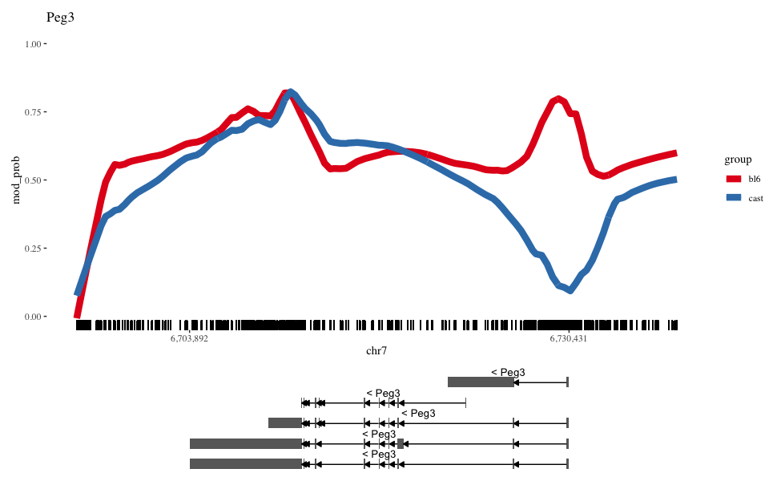

# NanoMethViz

<!-- badges: start -->
[](https://codecov.io/gh/Shians/NanoMethViz?branch=master)
[](https://github.com/Shians/NanoMethViz/actions)
<!-- badges: end -->

NanoMethViz is a toolkit for visualising methylation data from Oxford Nanopore sequencing.

## Installation

You can install NanoMethViz from Bioconductor with:

``` r
if (!requireNamespace("BiocManager", quietly = TRUE))
    install.packages("BiocManager")

BiocManager::install("NanoMethViz")
```

To install the latest developmental version, use:

``` r
if (!requireNamespace("BiocManager", quietly = TRUE))
    install.packages("BiocManager")

BiocManager::install(version='devel')

BiocManager::install("NanoMethViz")
```

## Example

This package currently works with data from nanopolish and f5c, to import your data please see the following vignette

``` r
vignette("ImportingData", package = "NanoMethViz")
```

An introductory example for plotting can be found in the package vignette:

``` r
vignette("Introduction", package = "NanoMethViz")
```

An example of the visualisation for Peg3



## License

This project is licensed under Apache License, Version 2.0.
