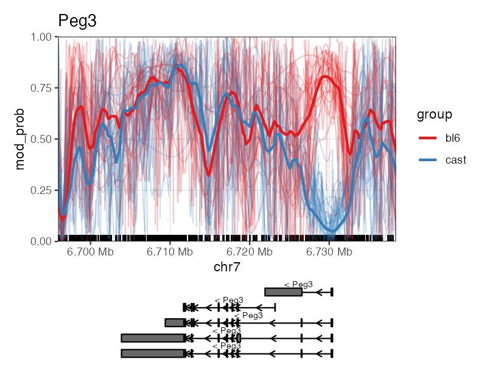

# NanoMethViz

<!-- badges: start -->
<!-- badges: end -->

NanoMethViz is a toolkit for visualising methylation data from Oxford Nanopore sequencing.

## Installation

You can install NanoMethViz from GitHub with:

``` r
remotes::install_github("shians/NanoMethViz")
```

## Example

A introductory example can be found in the package vignette:

``` r
vignette("Introduction", package = "NanoMethViz")
```

A example of the visualisation for Peg3



## License

This project is licensed under Apache License, Version 2.0.
