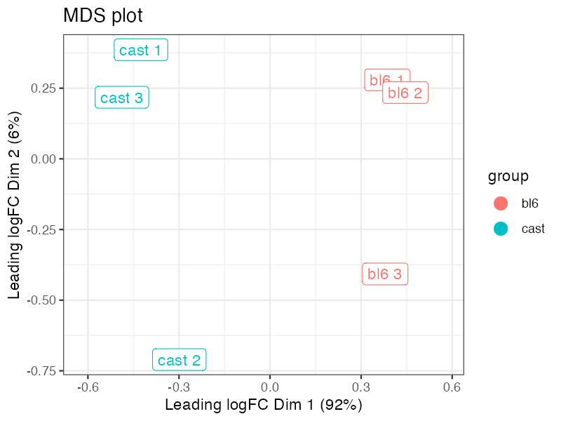
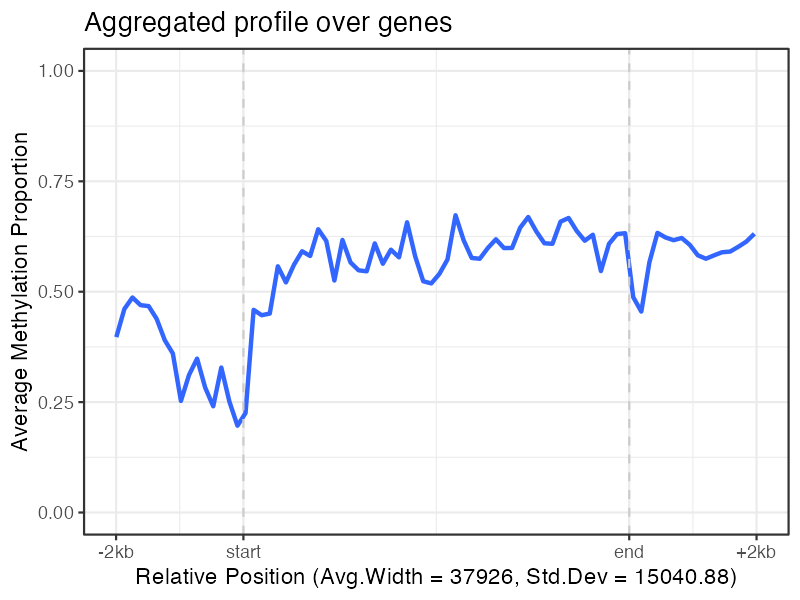
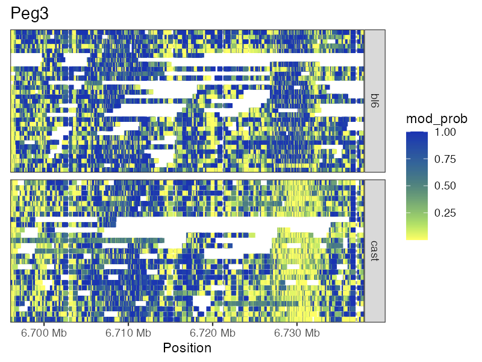

# NanoMethViz

<!-- badges: start -->
[](https://codecov.io/gh/Shians/NanoMethViz?branch=master)
[](https://github.com/Shians/NanoMethViz/actions)
<!-- badges: end -->

NanoMethViz is a toolkit for visualising methylation data from Oxford Nanopore sequencing.

## Installation

You can install NanoMethViz from Bioconductor with:

``` r
if (!requireNamespace("BiocManager", quietly = TRUE))
    install.packages("BiocManager")

BiocManager::install("NanoMethViz")
```

To install the latest developmental version, use:

``` r
if (!requireNamespace("BiocManager", quietly = TRUE))
    install.packages("BiocManager")

BiocManager::install(version='devel')

BiocManager::install("NanoMethViz")
```

## Usage

This package currently works with data from megalodon, nanopolish and f5c, to import your data please see the following vignette

``` r
vignette("ImportingData", package = "NanoMethViz")
```

An introductory example for plotting can be found in the package vignette:

``` r
vignette("Introduction", package = "NanoMethViz")
```

Other vignettes are provided for various features:

``` r
# how to use dimensionality reduction plots
vignette("DimensionalityReduction", package = "NanoMethViz")

# how to import external annotations
vignette("ExonAnnotations", package = "NanoMethViz")
```

## Examples

### MDS Plot

The MDS plot is used to visualise differences in the methylation profiles of
multiple samples.



### Feature Aggregation

The feature aggregation plot can average the methylation profiles across a set
of features.



### Spaghetti plot

The spaghetti plot shows the smoothed methylation probabilities over a specific
region, along with the methylation probabilities along individual long reads.


### Heatmap

The heatmap shows methylation probabilities on individual sites along stacked
reads.



## License

This project is licensed under Apache License, Version 2.0.
