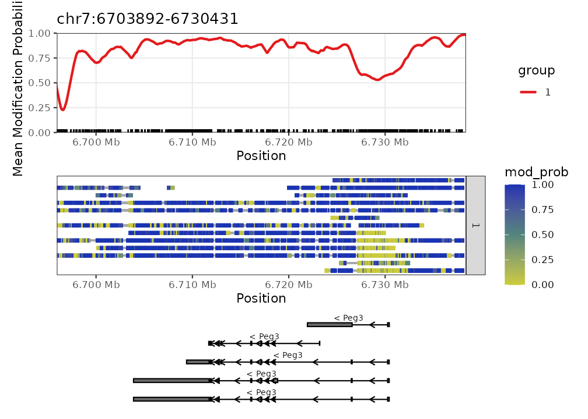
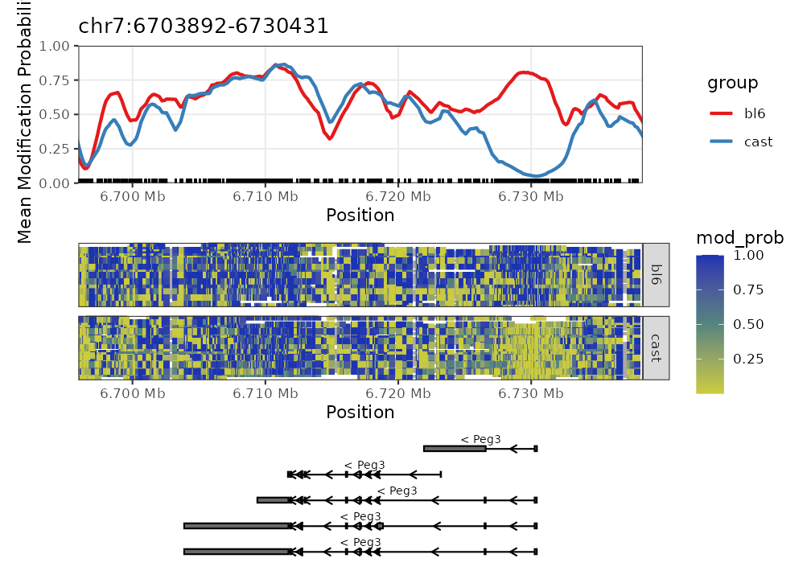
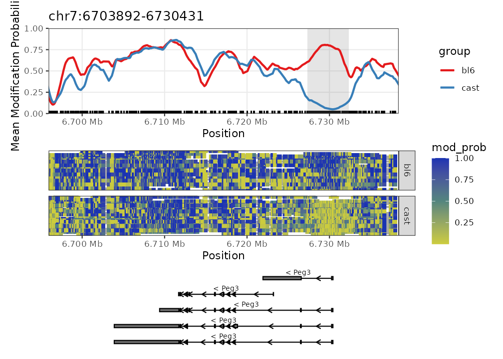
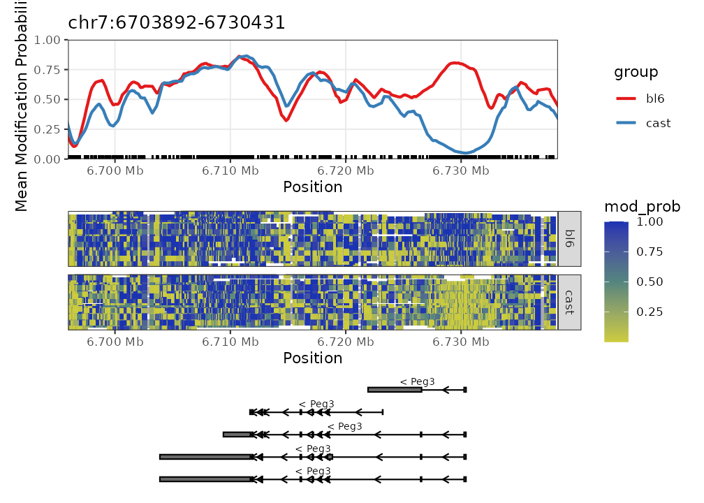
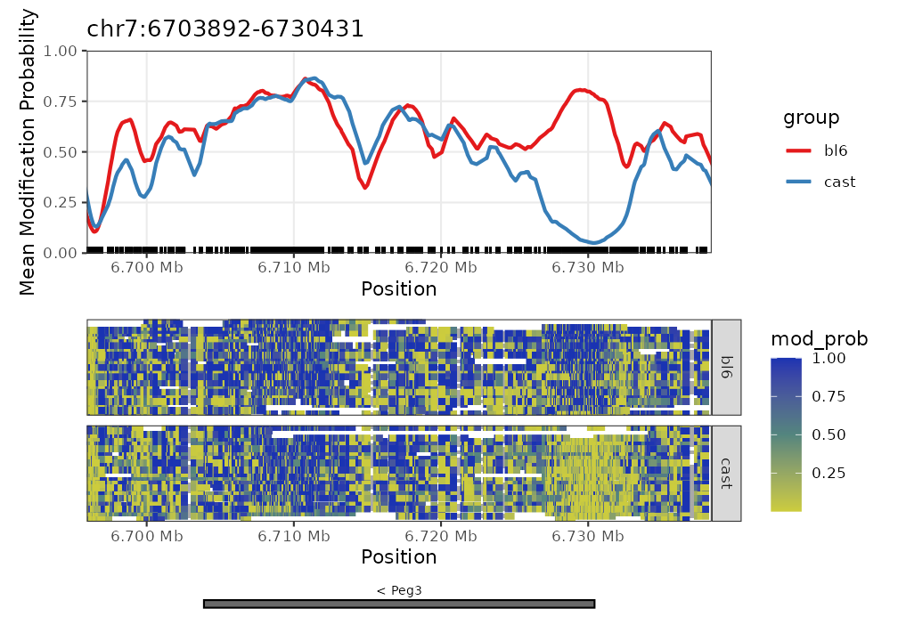
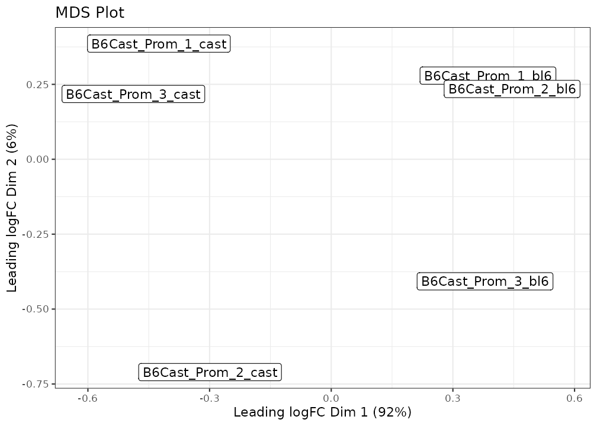
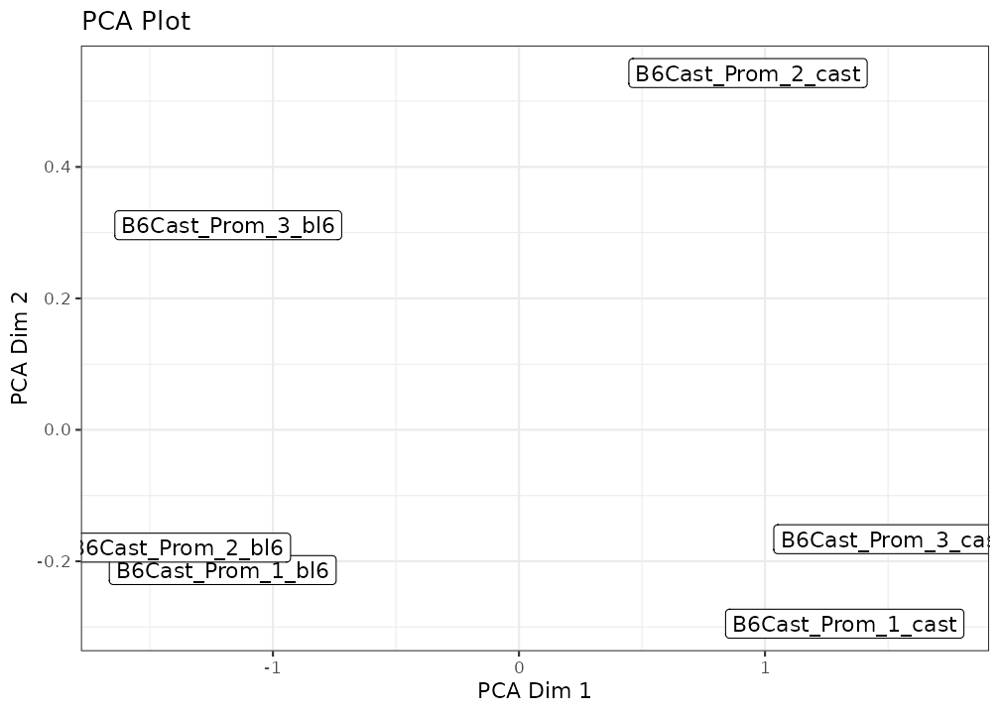
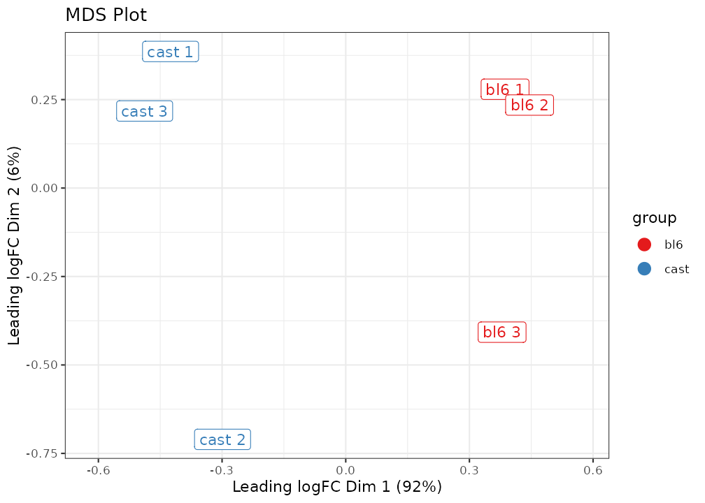

# User's Guide

## Introduction

The `NanoMethViz` package is designed to visualise methylation data from
long-read sequencing. It provides a simple interface to plot methylation
data, and to perform dimensionality reduction on the data. The package
is designed to work with methylation data on a per-read basis.

We provide functions for converting to various formats for downstream
analysis, and visualising methylation data at various levels of
resolution. Features are all developed to work with 5mC CpG methylation
data, but it will work with other modifications if the data is in the
correct format, as the type of modification is not generally specified
in the data.

This package is designed to work with methylation data from the Oxford
Nanopore Technologies (ONT) platform. Currently it supports data from
the following software:

- dorado (modBAM)
- modkit (tsv generated by `modkit extract full`)
- Megalodon (tsv)
- Nanopolish (tsv)
- f5c (tsv)

It is possible to use data from other software as long as it matches the
format of the data used in this package. If you would like any further
other formats supported please create an issue at
<https://github.com/Shians/NanoMethViz/issues>.

## Installation

To install this package, run

``` r
if (!requireNamespace("BiocManager", quietly = TRUE))
    install.packages("BiocManager")

BiocManager::install("NanoMethViz")
```

``` r
library(NanoMethViz)
library(dplyr)
```

## Importing data

In order to use this package, your data must be converted from the
output of methylation calling software to a tabix-indexed bgzipped
format. The data needs to be sorted by genomic position to respect the
requirements of the samtools [tabix](http://www.htslib.org/doc/tabix.md)
indexing tool. On Linux and macOS systems this is done using the bash
`sort` utility, which is memory efficient, but on Windows this is done
by loading the entire table and sorting within R.

### modBAM data

In the latest versions of `dorado` and other ONT software, the
modifications are stored in the BAM file. This can be used directly with
`NanoMethViz` using the `ModBamResult` class as a substitute for
`NanoMethResult`.

This requires a `ModBamFiles` object, which is a list of paths to the
BAM files and the sample names. The sample names must match the sample
names in the `sample_anno` data frame.

Because the BAM files contain significantly more data than the tabix
files, it may be useful to convert the BAM files to tabix files using
the
[`modbam_to_tabix()`](https://shians.github.io/NanoMethViz/reference/modbam_to_tabix.md)
function for sharing the data.

In modBAM files the modification calls are made along the read, allowing
sequencing errors to produce modification calls where there are none in
the genome. This may lead to noise impacting the averaging results. The
`NanoMethViz.site_filter` option can be used to remove sites with low
coverage. By default it is set to 3, which removes any sites with
coverage less than 3. See the “Site filtering” section for more
information.

``` r
# construct with a ModBamFiles object as the methylation data
mbr <- ModBamResult(
    methy = ModBamFiles(
        samples = "sample1",
        system.file(package = "NanoMethViz", "peg3.bam")
    ),
    samples = data.frame(
        sample = "sample1",
        group = 1
    ),
    exons = exon_tibble
)
```

    ## Successfully created ModBamResult with 1 matched samples.

``` r
# use in the same way as you would a NanoMethResult object
plot_gene(mbr, "Peg3", heatmap = TRUE)
```



### Tabular data (Modkit, Megalodon, Nanopolish, f5c)

Tabular data is the most common format for methylation data, and is the
format used by most software. The columns in the tabular data vary
according to the software used. `NanoMethViz` will attempt to
automatically detect the format of the data.

#### Modkit

Modkit can be used to extract site-level modification data from modBAM
files. The `modkit extract full` command will output a tab-separated
file with the required columns that can be converted using the
[`create_tabix_file()`](https://shians.github.io/NanoMethViz/reference/create_tabix_file.md)
function.

NOTE: `modkit` BED files are not supported as they do not contain
read-level information, only position-aggregated data.

### Megalodon

To import data from Megalodon’s modification calls, the [per-read
modified
bases](https://nanoporetech.github.io/megalodon/file_formats.html#per-read-modified-bases)
file must be generated. This can be done by either adding
`--write-mods-text` argument to Megalodon run or using the
`megalodon_extras per_read_text modified_bases` utility.

Later versions of Megalodon will also produce `modBAM` files, which can
be used directly with `NanoMethViz` using the `ModBamResult` class as a
substitute for `NanoMethResult`.

### Importing to tabix format

Once you have produced the correct output from the software listed
above, the conversion can be done using the
[`create_tabix_file()`](https://shians.github.io/NanoMethViz/reference/create_tabix_file.md)
function. We provide example nanopolish output data within the package.

``` r
methy_calls <- system.file(package = "NanoMethViz",
    c("sample1_nanopolish.tsv.gz", "sample2_nanopolish.tsv.gz"))
```

We then create a temporary path to store a converted file, this will be
deleted once you exit your R session. Once
[`create_tabix_file()`](https://shians.github.io/NanoMethViz/reference/create_tabix_file.md)
is run, it will create a .bgz file along with its tabix index. Because
we have a small amount of data, we can read in a small portion of it for
inspection, do not do this with large datasets as it decompresses all
the data and will take very long to run.

### Importing data

``` r
# create a temporary file to store the converted data
methy_tabix <- file.path(tempdir(), "methy_data.bgz")
samples <- c("sample1", "sample2")

# you should see messages when running this yourself
create_tabix_file(methy_calls, methy_tabix, samples)

# don't do this with full datasets, it will take a long time
# we have to use gzfile to tell R that we have a gzip compressed file
methy_data <- read.table(
    gzfile(methy_tabix), col.names = methy_col_names(), nrows = 6)

methy_data
```

    ##    sample  chr      pos strand statistic                            read_name
    ## 1 sample2 chr1  5141051      -      6.93 3818f2e2-d520-4305-bbab-efad891f67f2
    ## 2 sample1 chr1  6283068      -      1.05 36e3c55f-c41f-4bd6-b371-54368d013008
    ## 3 sample1 chr1  7975279      -      1.39 6f6cbc59-af4c-4dfa-8e48-ef4ac4eeb13b
    ## 4 sample1 chr1 10230293      -      2.19 fbe53b38-e264-4c7a-824e-2651c22f8ea6
    ## 5 sample1 chr1 13127128      -      2.51 7660ba1f-9b44-4783-b901-ed79b2f0481b
    ## 6 sample1 chr1 13127135      -      2.51 7660ba1f-9b44-4783-b901-ed79b2f0481b

Now `methy_tabix` will be the path to a tabix object that is ready for
use with NanoMethViz.

## Quick start

### Constructing the NanoMethResult object

To generate a methylation plot we need 3 components:

- methylation data in tabix format
- annotation of exons
- annotation of samples

The methylation information has been modified from the output of
nanopolish/f5c. It has then been compressed and indexed using `bgzip()`
and `indexTabix()` from the `Rsamtools` package. Here
[`system.file()`](https://rdrr.io/r/base/system.file.html) is used to
retrieve data internal to the package. For your own data, you simply
need to provide a path without the
[`system.file()`](https://rdrr.io/r/base/system.file.html) function.

``` r
# methylation data stored in tabix file
methy <- system.file(package = "NanoMethViz", "methy_subset.tsv.bgz")

# tabix is just a special gzipped tab-separated-values file
read.table(gzfile(methy), col.names = methy_col_names(), nrows = 6)
```

    ##               sample   chr       pos strand statistic
    ## 1  B6Cast_Prom_1_bl6 chr11 101463573      *     -0.33
    ## 2  B6Cast_Prom_1_bl6 chr11 101463573      *     -1.87
    ## 3  B6Cast_Prom_1_bl6 chr11 101463573      *     -4.19
    ## 4  B6Cast_Prom_1_bl6 chr11 101463573      *      0.10
    ## 5 B6Cast_Prom_1_cast chr11 101463573      *     -0.38
    ## 6 B6Cast_Prom_1_cast chr11 101463573      *     -0.84
    ##                              read_name
    ## 1 6cc38b35-6570-4b44-a1e3-2605fcf2ffe8
    ## 2 787f5f43-d144-4e15-ab7d-6b1474083389
    ## 3 c7ee7fb4-a915-4da7-9f36-da6ed5e68af2
    ## 4 bff8b135-0296-4495-9354-098242ea8cc4
    ## 5 11fe130b-8d48-4399-a9fa-2ca2860fa355
    ## 6 502fef95-c2f2-46ad-9bc5-fb3fc80b4245

The exon annotation was obtained from the `Mus.musculus` package, and
joined into a single table. It is important that the chromosomes share
the same convention as that found in the methylation data.

``` r
# helper function extracts exons from TxDb package
exon_tibble <- get_exons_mm10()

head(exon_tibble)
```

    ## # A tibble: 6 × 7
    ##   gene_id   chr   strand    start      end transcript_id symbol
    ##   <chr>     <chr> <chr>     <int>    <int>         <int> <chr> 
    ## 1 100009600 chr9  -      21062393 21062717         74536 Zglp1 
    ## 2 100009600 chr9  -      21062894 21062987         74536 Zglp1 
    ## 3 100009600 chr9  -      21063314 21063396         74536 Zglp1 
    ## 4 100009600 chr9  -      21066024 21066377         74536 Zglp1 
    ## 5 100009600 chr9  -      21066940 21067093         74536 Zglp1 
    ## 6 100009600 chr9  -      21062400 21062717         74538 Zglp1

We will define the sample annotation ourselves. It is important that the
sample names match those found in the methylation data.

``` r
sample <- c(
  "B6Cast_Prom_1_bl6", "B6Cast_Prom_1_cast",
  "B6Cast_Prom_2_bl6", "B6Cast_Prom_2_cast",
  "B6Cast_Prom_3_bl6", "B6Cast_Prom_3_cast"
)

group <- c("bl6", "cast", "bl6", "cast", "bl6", "cast")

sample_anno <- data.frame(sample, group, stringsAsFactors = FALSE)

sample_anno
```

    ##               sample group
    ## 1  B6Cast_Prom_1_bl6   bl6
    ## 2 B6Cast_Prom_1_cast  cast
    ## 3  B6Cast_Prom_2_bl6   bl6
    ## 4 B6Cast_Prom_2_cast  cast
    ## 5  B6Cast_Prom_3_bl6   bl6
    ## 6 B6Cast_Prom_3_cast  cast

For convenience we assemble these three pieces of data into a single
object.

``` r
nmr <- NanoMethResult(methy, sample_anno, exon_tibble)
```

    ## Successfully matched 6 samples between data and annotation.

The genes we have available are

- Peg3
- Meg3
- Impact
- Xist
- Brca1
- Brca2

### Basic Plotting

For demonstrative purposes we will plot Peg3. The plot on top shows the
average methylation probabilities across all samples for each
experimental condition. The heatmap below it shows the methylation
probabilities along individual reads, with disjoint reads stacked onto
the same row. The annotation down the bottom shows the isoforms of the
Peg3 gene as well as its directionality.

``` r
plot_gene(nmr, "Peg3")
```



We can also load in some DMR results to highlight DMR regions.

``` r
# loading saved results from previous bsseq analysis
bsseq_dmr <- read.table(
    system.file(package = "NanoMethViz", "dmr_subset.tsv.gz"),
    sep = "\t",
    header = TRUE,
    stringsAsFactors = FALSE
)
```

``` r
plot_gene(nmr, "Peg3", anno_regions = bsseq_dmr)
```



See other plotting options in the [package
documentation](https://shians.github.io/NanoMethViz/reference/index.html).

## Exporting data

The methylation data can be exported into formats appropriate for bsseq,
DSS, or edgeR.

### bsseq and DSS

Both bsseq and DSS make use of the BSSeq object, and these can be
obtained from the NanoMethResult objects using the
[`methy_to_bsseq()`](https://shians.github.io/NanoMethViz/reference/methy_to_bsseq.md)
function.

``` r
nmr <- load_example_nanomethresult()
bss <- methy_to_bsseq(nmr)

bss
```

    ## An object of type 'BSseq' with
    ##   4778 methylation loci
    ##   6 samples
    ## has not been smoothed
    ## All assays are in-memory

### edgeR

edgeR can also be used to perform differential methylation analysis:
<https://f1000research.com/articles/6-2055>. BSseq objects can be
converted into the appropriate format using the
[`bsseq_to_edger()`](https://shians.github.io/NanoMethViz/reference/bsseq_to_edger.md)
function. This can be used to count reads on a per-site basis or over
regions.

``` r
gene_regions <- exons_to_genes(NanoMethViz::exons(nmr))
edger_mat <- bsseq_to_edger(bss, gene_regions)

edger_mat
```

    ##        B6Cast_Prom_1_bl6_Me B6Cast_Prom_1_bl6_Un B6Cast_Prom_1_cast_Me
    ## 12189                  3259                 2033                  2628
    ## 12190                  2384                 1349                  1604
    ## 16210                  2696                 1173                  1564
    ## 17263                  1752                 1672                  2156
    ## 18616                  1812                  595                  1436
    ## 213742                 1264                  803                   848
    ##        B6Cast_Prom_1_cast_Un B6Cast_Prom_2_bl6_Me B6Cast_Prom_2_bl6_Un
    ## 12189                   1970                 3380                 1764
    ## 12190                   1627                 2564                 1853
    ## 16210                   1788                 2544                  895
    ## 17263                   1831                 2027                 1698
    ## 18616                   1184                 1690                  573
    ## 213742                  1465                 1012                  596
    ##        B6Cast_Prom_2_cast_Me B6Cast_Prom_2_cast_Un B6Cast_Prom_3_bl6_Me
    ## 12189                   2663                  2043                 3658
    ## 12190                   1860                  1573                 2110
    ## 16210                   1630                  1693                 1955
    ## 17263                   1349                  1153                 1787
    ## 18616                   1442                  1520                 3011
    ## 213742                  1072                  1040                 1432
    ##        B6Cast_Prom_3_bl6_Un B6Cast_Prom_3_cast_Me B6Cast_Prom_3_cast_Un
    ## 12189                  2341                  2565                  1968
    ## 12190                  1502                  1884                  1663
    ## 16210                   769                  1466                  1787
    ## 17263                  1880                  1883                  1694
    ## 18616                  1331                   948                   931
    ## 213742                  728                   653                  1189

## Importing Annotations

This package comes with helper functions that import exon annotations
from the Bioconductor packages `Homo.sapiens` and `Mus.musculus`. The
functions
[`get_exons_hg19()`](https://shians.github.io/NanoMethViz/reference/get_exons.md)
and
[`get_exons_mm10()`](https://shians.github.io/NanoMethViz/reference/get_exons.md)
simply take data from the respective packages, and reorganise the
columns into the following columns:

- gene_id
- chr
- strand
- start
- end
- transcript_id
- symbol

This is used to provide gene annotations for the gene or region plots.

For other annotations, they will most likely be able to be imported
using `rtracklayer::import()` and manipulated into the desired format.
As an example, we can use a small sample of the C. Elegans gene
annotation provided by ENSEMBL. `rtracklayer` will import the annotation
as a `GRanges` object, this can be coerced into a data.frame and
manipulated using `dplyr`.

``` r
anno <- rtracklayer::import(system.file(package = "NanoMethViz", "c_elegans.gtf.gz"))

head(anno)
```

    ## GRanges object with 6 ranges and 13 metadata columns:
    ##       seqnames          ranges strand |   source     type     score     phase
    ##          <Rle>       <IRanges>  <Rle> | <factor> <factor> <numeric> <integer>
    ##   [1]       IV 9601517-9601695      - | WormBase     exon        NA      <NA>
    ##   [2]       IV 9601040-9601345      - | WormBase     exon        NA      <NA>
    ##   [3]       IV 9600828-9600953      - | WormBase     exon        NA      <NA>
    ##   [4]       IV 9600627-9600780      - | WormBase     exon        NA      <NA>
    ##   [5]       IV 9600002-9600392      - | WormBase     exon        NA      <NA>
    ##   [6]       IV 9599702-9599873      - | WormBase     exon        NA      <NA>
    ##              gene_id transcript_id exon_number   gene_name gene_source
    ##          <character>   <character> <character> <character> <character>
    ##   [1] WBGene00000002     F27C8.1.1           1       aat-1    WormBase
    ##   [2] WBGene00000002     F27C8.1.1           2       aat-1    WormBase
    ##   [3] WBGene00000002     F27C8.1.1           3       aat-1    WormBase
    ##   [4] WBGene00000002     F27C8.1.1           4       aat-1    WormBase
    ##   [5] WBGene00000002     F27C8.1.1           5       aat-1    WormBase
    ##   [6] WBGene00000002     F27C8.1.1           6       aat-1    WormBase
    ##         gene_biotype transcript_source transcript_biotype      exon_id
    ##          <character>       <character>        <character>  <character>
    ##   [1] protein_coding          WormBase     protein_coding F27C8.1.1.e1
    ##   [2] protein_coding          WormBase     protein_coding F27C8.1.1.e2
    ##   [3] protein_coding          WormBase     protein_coding F27C8.1.1.e3
    ##   [4] protein_coding          WormBase     protein_coding F27C8.1.1.e4
    ##   [5] protein_coding          WormBase     protein_coding F27C8.1.1.e5
    ##   [6] protein_coding          WormBase     protein_coding F27C8.1.1.e6
    ##   -------
    ##   seqinfo: 3 sequences from an unspecified genome; no seqlengths

``` r
anno <- anno %>%
    as.data.frame() %>%
    dplyr::rename(
        chr = "seqnames",
        symbol = "gene_name"
    ) %>%
    dplyr::select("gene_id", "chr", "strand", "start", "end", "transcript_id", "symbol")

head(anno)
```

    ##          gene_id chr strand   start     end transcript_id symbol
    ## 1 WBGene00000002  IV      - 9601517 9601695     F27C8.1.1  aat-1
    ## 2 WBGene00000002  IV      - 9601040 9601345     F27C8.1.1  aat-1
    ## 3 WBGene00000002  IV      - 9600828 9600953     F27C8.1.1  aat-1
    ## 4 WBGene00000002  IV      - 9600627 9600780     F27C8.1.1  aat-1
    ## 5 WBGene00000002  IV      - 9600002 9600392     F27C8.1.1  aat-1
    ## 6 WBGene00000002  IV      - 9599702 9599873     F27C8.1.1  aat-1

### Importing Annotations

Annotations can be simplified if full exon and isoform information is
not required. For example, gene-body annotation can be represented as
single exon genes. For example we can take the example dataset and
transform the isoform annotations of Peg3 into a single gene-body block.
The helper function
[`exons_to_genes()`](https://shians.github.io/NanoMethViz/reference/exons_to_genes.md)
can help with this common conversion.

``` r
nmr <- load_example_nanomethresult()

plot_gene(nmr, "Peg3")
```



``` r
new_exons <- NanoMethViz::exons(nmr) %>%
    exons_to_genes() %>%
    mutate(transcript_id = gene_id)

NanoMethViz::exons(nmr) <- new_exons

plot_gene(nmr, "Peg3")
```



## Dimensionality reduction

Dimensionality reduction is used to represent high dimensional data in a
more tractable form. It is commonly used in RNA-seq analysis, where each
sample is characterised by tens of thousands of gene expression values,
to visualise samples in a 2D plane with distances between points
representing similarity and dissimilarity. For RNA-seq the data used is
generally gene counts, for methylation there are generally two relevant
count matrices, the count of methylated bases, and the count of
methylated bases. The information from these two matrices can be
combined by taking log-methylation ratios as done in Chen et al. 2018.

#### Preparing data for dimensionality reduction

It is assumed that users of this package have imported the data into the
gzipped tabix format. From there, further processing is required to
create the log-methylation-ratio matrix used in dimensionality
reduction. Namely we go through the BSseq format as it is easily coerced
into the desired matrix and is itself useful for various other analyses.

``` r
# convert to bsseq
bss <- methy_to_bsseq(nmr)
bss
```

    ## An object of type 'BSseq' with
    ##   4778 methylation loci
    ##   6 samples
    ## has not been smoothed
    ## All assays are in-memory

We can generate the log-methylation-ratio based on individual
methylation sites or computed over genes, or other feature types.
Aggregating over features will generally provide more stable and robust
results, here we will use genes.

``` r
# create gene annotation from exon annotation
gene_anno <- exons_to_genes(NanoMethViz::exons(nmr))

# create log-methylation-ratio matrix
lmr <- bsseq_to_log_methy_ratio(bss, regions = gene_anno)
```

NanoMethViz currently provides two options, a MDS plot based on the
limma implementation of MDS, and a PCA plot using BiocSingular.

``` r
plot_mds(lmr) +
    ggtitle("MDS Plot")
```



``` r
plot_pca(lmr) +
    ggtitle("PCA Plot")
```



Additional coloring and labeling options can be provided via arguments
to either function. Further customisations can be done using typical
ggplot2 commands.

``` r
new_labels <- gsub("B6Cast_Prom_", "", colnames(lmr))
new_labels <- gsub("(\\d)_(.*)", "\\2 \\1", new_labels)
groups <- gsub(" \\d", "", new_labels)

plot_mds(lmr, labels = new_labels, groups = groups) +
    ggtitle("MDS Plot") +
    scale_colour_brewer(palette = "Set1")
```



Points can also be plotted without labels by setting `labels = NULL`.

``` r
plot_mds(lmr, labels = NULL, groups = groups) +
    ggtitle("MDS Plot") +
    scale_colour_brewer(palette = "Set1")
```


## Package options

### Site filtering

NanoMethViz offers a site filtering option to remove sites with low
coverage. This is particularly useful for modBAM files as modification
calls are made along reads, allowing methylation to be called at
miscalled sites. The site filter is set to 3 by default, filtering out
any sites with coverage less than 3. This can be changed using the
option `NanoMethViz.site_filter`. The following will remove any sites
with coverage less than 5 from queries and plots.

``` r
options("NanoMethViz.site_filter" = 5)
```

### Region annotation colours

By default the `anno_regions` argument in plotting functions will create
bands coloured grey, specifically `grey50`. This can be changed globally
across the package using the option `NanoMethViz.highlight_col`. For
example the following will change the colour to red.

``` r
options("NanoMethViz.highlight_col" = "red")
```
