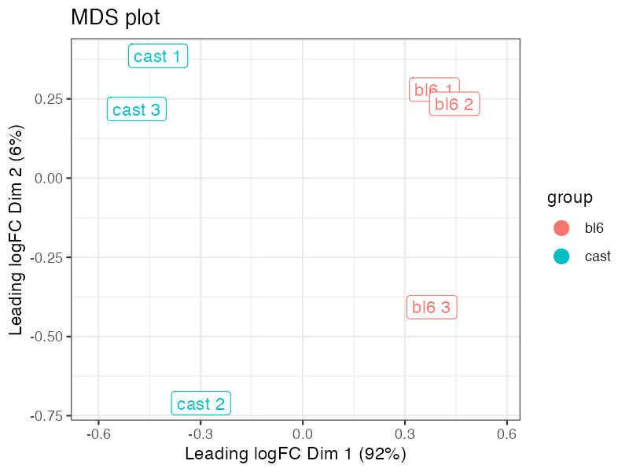
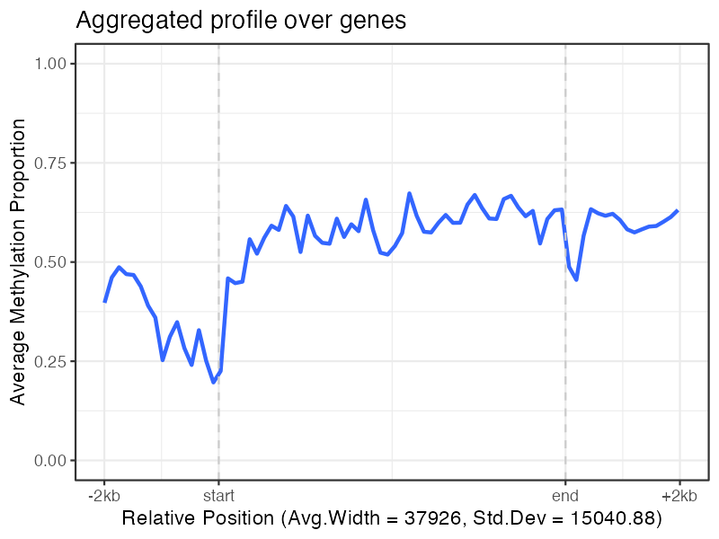
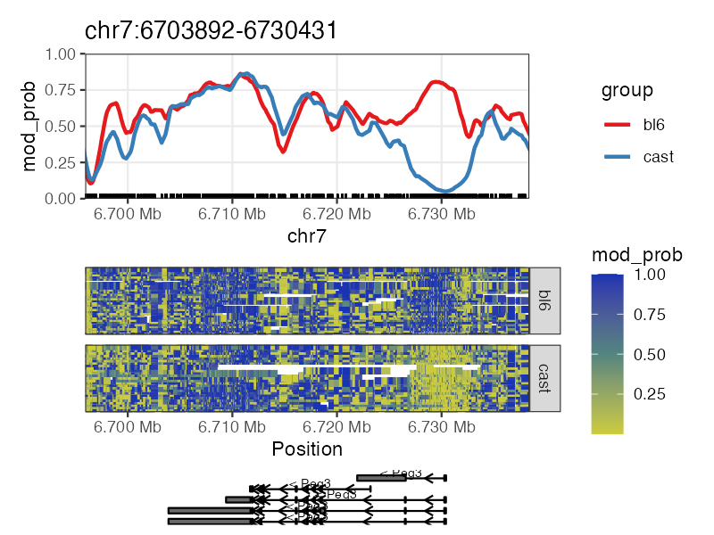

# NanoMethViz

NanoMethViz is a toolkit for visualising methylation data from Oxford
Nanopore sequencing.

## Installation

You can install NanoMethViz from Bioconductor with:

``` r
if (!requireNamespace("BiocManager", quietly = TRUE))
    install.packages("BiocManager")

BiocManager::install("NanoMethViz")
```

To install the latest developmental version, use:

``` r
if (!requireNamespace("BiocManager", quietly = TRUE))
    install.packages("BiocManager")

BiocManager::install(version='devel')

BiocManager::install("NanoMethViz")
```

## Usage

This package currently works with data from dorado, megalodon,
nanopolish and f5c, for information on how to use the package, please
refer to the [Users
Guide](https://www.bioconductor.org/packages/release/bioc/vignettes/NanoMethViz/inst/doc/UsersGuide.html).

## Examples

### MDS Plot

The MDS plot is used to visualise differences in the methylation
profiles of multiple samples.



### Feature Aggregation

The feature aggregation plot can average the methylation profiles across
a set of features.



### Region Methylation Plot

The region methylation plot can visualise the methylation profile of a
region of interest. As well as provide a heatmap of the methylation
along individual reads.



## License

This project is licensed under Apache License, Version 2.0.
